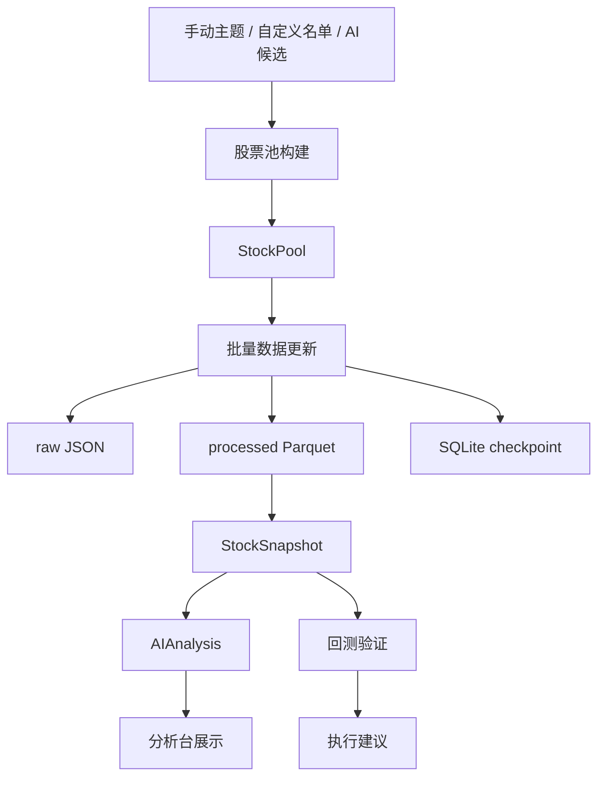

# QuantPlatform

美股交易系统主目录。

当前目标：

- 搭建股票池驱动的数据分析产品骨架
- 优先支持免费数据接口
- 先做股票池、数据层、分析层和回测底座
- 后续扩展到网页分析台和半自动执行

Codex 接手入口：

- [AGENTS.md](/Users/louyilin/项目文件夹/QuantPlatform/AGENTS.md)

## 当前进度

- 已完成项目分层骨架和本地存储结构初始化
- 已完成 `yfinance` 历史日线接入
- 已完成原始 `JSON` 落盘、处理后 `Parquet` 落盘
- 已完成基于 `SQLite` 的增量更新 checkpoint
- 已完成股票筛选的第一版设计与股票池构建骨架
- 已完成 `StockPool / StockSnapshot / AIAnalysis` 产品对象骨架
- 已完成纳斯达克100独立股票池、最新快照批量抓取链路和第一版本地 UI
- 已完成第一版券商式个股界面，当前前台范围收敛为 `默认列表 + 自选列表`
- 已完成中文 UI 文案、中文池子名称和常用公司/行业中文映射
- 已完成终端式四栏 UI 骨架：图标导航、股票列表、主工作区、右侧分析区
- 已将主图区比例收敛为更紧凑的终端布局，避免走势图过大影响工作台信息密度
- 已支持左右分栏伸缩，便于后续扩展右侧新闻和 AI 分析面板
- 已完成第一版简单建议引擎，基于历史价格与当前快照输出趋势、风险和动作建议
- 下一步重点是策略规格、数据层保护、技术指标、信号检测、风控建议和每日报告

## 当前主流程

系统当前按下面的主链路推进：

1. 先确定股票候选来源
2. 再形成正式股票池对象
3. 针对股票池批量更新最新快照
4. 计算技术指标、规则信号和风险建议
5. 生成每日报告，供人工复盘和 AI 辅助研判
6. 用同一套指标和信号进入回测验证

当前 UI 第一版遵循最小化原则：

- 默认只展示 `默认列表`
- 支持通过搜索把股票手动加入 `自选列表`
- 每只股票都提供独立图形界面和当前快照指标
- 右侧分析区已接入第一版系统判断，会展示风险等级、关键点和风险提示
- 复杂列表和更多资产分类后续再逐步放开

## 流程图

## 产品对象

当前产品层围绕三个对象展开：

1. `StockPool`
2. `StockSnapshot`
3. `AIAnalysis`

它们和当前工程层的关系是：

- `screeners`：负责候选合并和基础筛选
- `services`：负责把筛选结果升级成产品对象
- `storage`：负责产品产物的物理组织

对应设计文档：

- [docs/architecture/stock-screening-design.md](/Users/louyilin/项目文件夹/QuantPlatform/docs/architecture/stock-screening-design.md)
- [docs/architecture/product-objects.md](/Users/louyilin/项目文件夹/QuantPlatform/docs/architecture/product-objects.md)

Codex 新会话请先阅读：

- [AGENTS.md](/Users/louyilin/项目文件夹/QuantPlatform/AGENTS.md)

`AGENTS.md` 会指向当前需要继续阅读的计划、上下文和交接文档。

当前可用脚本：

- 初始化本地目录和状态库：`PYTHONPATH=src python3 scripts/bootstrap_local_state.py`
- 生成纳斯达克100股票池：`PYTHONPATH=src python3 scripts/build_nasdaq100_pool.py`
- 更新单个标的历史日线：`PYTHONPATH=src python3 scripts/update_yfinance_history.py AAPL --start 2025-01-01 --end 2025-01-15`
- 按配置构建股票池快照：`PYTHONPATH=src python3 scripts/build_universe.py`
- 批量更新股票池最新快照：`PYTHONPATH=src python3 scripts/update_pool_snapshots.py`
- 启动本地 UI：`python3 scripts/serve_ui.py`

下一阶段计划入口：

- [tasks/plan.md](/Users/louyilin/项目文件夹/QuantPlatform/tasks/plan.md)
- [tasks/roadmap.md](/Users/louyilin/项目文件夹/QuantPlatform/tasks/roadmap.md)

## 审阅约定

- 后续每次推进实现，我都会同步更新 `README.md`
- `README.md` 会优先记录当前进度、主流程和入口脚本
- 关键阶段尽量补流程图，方便你快速审阅代码方向
