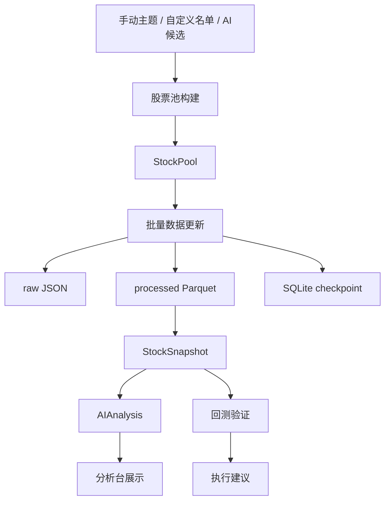

# QuantPlatform

美股交易系统主目录。

当前目标：

- 搭建股票池驱动的数据分析产品骨架
- 优先支持免费数据接口
- 先做股票池、数据层、分析层和回测底座
- 后续扩展到网页分析台和半自动执行
- 只做信息分析和人工决策辅助，不实现真实下单、撤单、改单或自动交易动作

Codex 接手入口：

- [AGENTS.md](/Users/louyilin/项目文件夹/QuantPlatform/AGENTS.md)

## 当前进度

- 已完成项目分层骨架和本地存储结构初始化
- 已完成 `yfinance` 历史日线接入
- 已完成原始 `JSON` 落盘、处理后 `Parquet` 落盘
- 已完成基于 `SQLite` 的增量更新 checkpoint
- 已完成股票筛选的第一版设计与股票池构建骨架
- 已完成 `StockPool / StockSnapshot / AIAnalysis` 产品对象骨架
- 已完成纳斯达克100独立股票池、最新快照批量抓取链路和第一版本地 UI
- 已完成第一版券商式个股界面，当前前台范围收敛为 `默认列表 + 自选列表`
- 已完成中文 UI 文案、中文池子名称和常用公司/行业中文映射
- 已完成终端式四栏 UI 骨架：图标导航、股票列表、主工作区、右侧分析区
- 已将 UI 视觉方向从玻璃拟态调整为更专业的纯色研究终端风格
- 已将主图区比例收敛为更紧凑的终端布局，中间区域新增交易指标矩阵，避免走势图过大影响信息密度
- 已支持左右分栏伸缩，便于后续扩展右侧新闻和 AI 分析面板
- 已完成第一版简单建议引擎，基于历史价格与当前快照输出趋势、风险和动作建议
- 已完成第一版日线波段策略规格文档
- 已为 `yfinance` 客户端接入配置化限频、重试、backoff 和 timeout 保护
- 已新增基础数据质量检查，批量快照会输出数据质量摘要
- 已完成第一版技术指标计算层，可从本地 processed parquet 输出完整序列和最新指标
- 已将技术指标接入批量快照，并对本地 bars 与快照时间做一致性检查
- 已完成第一版规则信号检测，可识别 MACD、RSI、布林带、放量突破、均线交叉和均线排列信号
- 已接入全市场重大事件日历，当前来源包括 Fed FOMC、Census 经济指标日历和 FRED release calendar
- 已增加本地操作日志，市场事件、UI 数据请求和股票快照刷新会写入 `data/logs/*.jsonl`
- 已新增单标的快照自动新鲜度检查：选中股票时若缓存缺少或落后 `latest_history_date_us`，会自动刷新，并用最新日线覆盖快照 OHLCV，保证收盘后尽量显示最新收盘信息
- 已修复左侧股票列表与单股快照不同步的问题：选中股票自动刷新或手动刷新后，当前列表会同步使用最新快照价格、涨跌幅和行情交易日
- 已新增 macOS `launchd` 盘后刷新安装脚本，可通过 `make schedule-install` 安装每天北京时间 06:30 的自动刷新任务
- 已新增 UI 服务内置盘后刷新调度器：`make ui` 启动后会在后台按北京时间 06:30 执行每日刷新，可通过 `/api/scheduler` 查看状态
- 已在右侧数据状态区展示定时任务状态、计划时间、最近一次全量刷新交易日和历史数据成功/失败数量
- 已加固 `yfinance` 历史请求：默认启用 `repair=True`，并预留 `prepost` 配置；批量请求最小间隔调整为 1 秒
- 已将新标的首次历史更新改为显式回填窗口，默认回填 10 年日线；已有足够历史后继续按 cursor 增量更新，单股支持 `--full-history` 获取上市以来尽可能完整的数据
- 已新增第二页“候选池扫描”MVP：`/api/scanner?pool_id=default_core` 基于本地快照、技术指标和数据状态输出候选表，前端可在“个股/扫描”之间切换
- 已将候选池扫描规则从 UI 服务拆到 `screeners/scanner.py`，输出结构化 `ScanSignal / ScanCandidate / ScanSummary`，后续可复用于日报、回测和策略迁移
- 已参考外部策略扫描方案，落地 `Scanner Strategy V1` 的第一批基础字段：池内截面动量排名、跳过最近 5 日的 20/60/120 日收益、RSI 变化、60 日成交量 z-score 和 ATR 归一化趋势距离；扫描页会在本地缓存缺少新字段时从本地 parquet 兜底计算，不联网
- 已新增综合每日报告 V1：同名 Markdown 供人工速读，同名 JSON 作为 AI 主入口，整合市场状态、scanner、真实持仓、自选股监控、期权建议、宏观/新闻情绪、数据刷新和数据缺口
- 已新增期权策略 MVP，支持 `cash_secured_put` 和 `covered_call` 的规则层风险检查；右侧工作栏已有“期权助手”入口，可手工输入合约并展示资金占用、盈亏平衡、硬性风险和观察项，不自动下单
- 已新增 Longbridge Terminal CLI 只读数据源原型，可通过本地 OAuth 登录后的 `longbridge quote` 获取实时、盘前和盘后行情，并归一化为项目快照字段
- 已将单股强制刷新接入 `quote_provider: auto`：优先 Longbridge CLI 获取实时/盘前/盘后快照，失败时 fallback 到 yfinance，前端数据状态展示快照来源
- 已新增 Longbridge 真实股票池同步：读取只读 `positions/watchlist`，过滤指数、期权和非 US 市场，生成本地 `longbridge_core` 股票池；持仓保留数量/成本价，自选保留分组
- 已新增真实持仓/自选基本策略分析：Longbridge 负责实时行情，yfinance 本地日线负责指标和信号，输出持仓健康度与自选关注度 JSON + Markdown
- 已新增模型驱动 AI 解读报告：`make ai-analyze` 读取最新账户健康 JSON，`make ai-options` 读取最新期权建议 JSON，`make ai-stock SYMBOL=AAPL` 读取单股快照并调用 DeepSeek/OpenAI-compatible provider 生成保守中文 Markdown；失败时明确标记模型错误，不再用 placeholder 代替真实解读
- 已新增真实持仓期权建议：读取 Longbridge 只读持仓，默认只扫描高流动性期权标的（AAPL/TSLA/NVDA/GOOGL/TSM 等），ETF、BRK.B 和低优先级标的会跳过并写入原因，避免全持仓期权链扫描超时
- 已新增期权截图文字解析工具：可从 OCR 文本或本机 OCR 图片中提取 expiry、strike、bid/ask，并可用 yfinance 期权链交叉验证
- 已新增账户健康度与风控报告：读取 Longbridge 只读账户、本地快照和事件日历；缺 ATR 时会尝试补齐本地 yfinance 日线并即时计算指标；ETF/特殊个股有行业兜底，并输出具体控仓/减仓金额建议
- 已新增历史交易复盘：读取 Longbridge 只读历史订单/成交记录，按股票多头 FIFO 统计胜率、盈亏比、平均持有时间、最大回撤、个股和月份表现
- 已新增自动扫描报告：汇总 Scanner Strategy V1 股票扫描、真实持仓 covered call / cash-secured put 建议和 CSP 观察候选，输出 JSON + Markdown
- 已完成 Claude Code 审核提出的 P0 修复：UI 服务优先读取 `config/settings.yaml`，指标引擎移除并发共享状态，调度器避免单票失败导致每日死循环重试，Longbridge CLI 数值和 symbol 输入做安全防护
- 已新增 Dashboard 聚合 API：`/api/dashboard` 只读本地 scanner、账户健康度、事件、AI 和日报产物，`/api/reports/latest` 返回最新 Markdown 日报，`POST /api/refresh` 后台触发收盘刷新 + 宏观代理刷新 + 日报生成
- UI 默认首页已从个股 K 线工作台改为“决策仪表板”，一屏展示市场状态、今日候选、持仓风控、近期事件、AI 研判和每日报告；个股和扫描视图保留在顶栏切换中
- 已将 `make daily-refresh` 升级为收盘后准备包：同步 Longbridge 真实持仓/自选池，刷新行情，生成账户健康、期权建议、AI 解读和每日报告，并默认在 terminal 打印关键步骤日志
- 每日报告新增“持仓、期权与 AI 自动分析”章节，会读取 daily refresh summary 的 `supplemental_outputs` 并摘录 AI Markdown
- 每日报告已升级为唯一综合日报：`daily_*.json` 使用 `daily_comprehensive_report_v1` 结构，逐个持仓输出基本面、资金流代理、机构/基金持仓数据状态、技术走势、情绪新闻和期权建议；Markdown 只做人工速读
- 已新增决策面板只读 AI 对话窗口：`POST /api/chat` 读取最新日报、scanner、账户健康、期权建议、宏观风险和 AI 解读等本地产物回答股票/期权问题，不输出自动下单指令
- 已新增宏观/新闻风险快照 MVP：`make macro-risk` 优先读取 Longbridge `market-temp` 和 `news`，结合本地 `SPY/QQQ/DIA/^VIX/sector ETF` 市场概览，写入 `data/reports/macro_risk/` 并接入 Dashboard 与 `daily-refresh`
- 下一步重点是把宏观/新闻风险更深地接入日报和 scanner 过滤规则，并实现最小信号驱动回测

## 当前主流程

系统当前按下面的主链路推进：

1. 先确定股票候选来源
2. 再形成正式股票池对象
3. 针对股票池批量更新最新快照
4. 计算技术指标、规则信号和风险建议
5. 生成每日报告，供人工复盘和 AI 辅助研判
6. 用同一套指标和信号进入回测验证

当前 UI 第一版遵循最小化原则：

- 默认显示“决策仪表板”，优先回答今天该看什么、该避开什么、持仓有什么风险
- 个股视图中默认优先展示 `长桥真实股票池`；本地尚未同步时回退到旧 `默认列表`
- 支持通过搜索把股票手动加入 `自选列表`
- 每只股票都提供独立图形界面和当前快照指标
- “扫描”视图展示当前股票池的候选动作、分数、趋势、RSI、MACD、成交量、风险和行情日期
- 右侧分析区已接入第一版系统判断，会展示风险等级、关键点和风险提示
- 股票推荐范围先聚焦 `NASDAQ 100`、`S&P 500`、高热度股票和用户自定义列表，复杂列表和全市场扫描后续再逐步放开

## 流程图

## 产品对象

当前产品层围绕三个对象展开：

1. `StockPool`
2. `StockSnapshot`
3. `AIAnalysis`

它们和当前工程层的关系是：

- `screeners`：负责候选合并和基础筛选
- `services`：负责把筛选结果升级成产品对象
- `storage`：负责产品产物的物理组织

对应设计文档：

- [docs/architecture/stock-screening-design.md](/Users/louyilin/项目文件夹/QuantPlatform/docs/architecture/stock-screening-design.md)
- [docs/architecture/product-objects.md](/Users/louyilin/项目文件夹/QuantPlatform/docs/architecture/product-objects.md)
- [docs/strategy/strategy-v1.md](/Users/louyilin/项目文件夹/QuantPlatform/docs/strategy/strategy-v1.md)
- [docs/strategy/scanner-strategy-v1.md](/Users/louyilin/项目文件夹/QuantPlatform/docs/strategy/scanner-strategy-v1.md)
- [docs/strategy/options-strategy-mvp.md](/Users/louyilin/项目文件夹/QuantPlatform/docs/strategy/options-strategy-mvp.md)
- [docs/strategy/options-assistant-v2-notes.md](/Users/louyilin/项目文件夹/QuantPlatform/docs/strategy/options-assistant-v2-notes.md)
- [docs/data-sources/longbridge-integration.md](/Users/louyilin/项目文件夹/QuantPlatform/docs/data-sources/longbridge-integration.md)

Codex 新会话请先阅读：

- [AGENTS.md](/Users/louyilin/项目文件夹/QuantPlatform/AGENTS.md)
- [PROJECT_MEMORY.md](/Users/louyilin/项目文件夹/QuantPlatform/PROJECT_MEMORY.md)

`AGENTS.md` 会指向当前需要继续阅读的计划、长期记忆和交接文档。

当前可用脚本：

- 初始化本地目录和状态库：`PYTHONPATH=src python3 scripts/bootstrap_local_state.py`
- 生成纳斯达克100股票池：`PYTHONPATH=src python3 scripts/build_nasdaq100_pool.py`
- 同步 Longbridge 真实股票池：`make longbridge-pool-sync`
- 生成 Longbridge 真实持仓/自选策略分析：`make longbridge-portfolio-analysis`
- 分析前顺带刷新 yfinance 日线历史：`make longbridge-portfolio-analysis UPDATE_HISTORY=1`
- 生成旧版 dashboard AI 摘要：`make analyze`
- 对最新账户健康报告做 DeepSeek 解读：`make ai-analyze`
- 对最新期权建议报告做 DeepSeek 解读：`make ai-options`
- 对单只股票做 DeepSeek 技术面解读：`make ai-stock SYMBOL=AAPL`
- 跳过模型层只生成规则结构化 AI 报告：`make analyze ANALYZE_ARGS=--no-model`
- 生成真实持仓期权策略建议：`make options-advice`（可用 `OPTIONS_ADVICE_ARGS="--timeout-seconds 45 --max-workers 2 --max-expirations-per-symbol 2"` 控制速度）
- 生成账户健康度与风控报告：`make account-health`
- 生成历史交易复盘报告：`make trade-review`
- 生成宏观、情绪和新闻风险快照：`make macro-risk`（可用 `MACRO_RISK_ARGS="--symbol AAPL --symbol NVDA"` 指定新闻检查标的）
- 生成股票 + 期权自动扫描报告：`make auto-scan`
- 解析期权截图 OCR 文本并用 yfinance 验证：`make option-screenshot OPTION_SCREENSHOT_ARGS="--text-file ocr.txt --symbol AAPL"`
- 更新单个标的历史日线：`PYTHONPATH=src python3 scripts/update_yfinance_history.py AAPL --start 2025-01-01 --end 2025-01-15`
- 按配置构建股票池快照：`PYTHONPATH=src python3 scripts/build_universe.py`
- 批量更新股票池最新快照：`PYTHONPATH=src python3 scripts/update_pool_snapshots.py`
- 计算单个标的本地技术指标：`PYTHONPATH=src python3 scripts/compute_indicators.py AAPL`
- 检测单个标的本地规则信号：`PYTHONPATH=src python3 scripts/detect_signals.py AAPL`
- 手动评估一笔期权策略：`PYTHONPATH=src python3 scripts/evaluate_option_strategy.py --strategy cash_secured_put --symbol TSM --as-of 2026-05-01 --underlying-price 140 --option-type put --strike 130 --expiration 2026-06-19 --bid 2.0 --ask 2.2 --delta -0.24 --open-interest 500`
- 查询 Longbridge CLI 只读行情：`make longbridge-quote LONGBRIDGE_SYMBOL=AAPL`
- 更新全市场重大事件日历：`PYTHONPATH=src python3 scripts/update_market_events.py --start 2026-01-01 --end 2026-12-31`
- 启动本地 UI：`python3 scripts/serve_ui.py`
- 启动本地 UI 快捷命令：`make ui`，自定义端口：`make ui PORT=8001`
- `make daily-refresh` 默认会在 terminal 打印关键进度：Longbridge 真实股票池同步、历史/快照刷新、账户健康、期权建议、AI 解读和日报生成；详细 JSONL 仍写入 `data/logs/*.jsonl`
- 如需调试其它命令的逐条日志：`make daily-report LOG_TO_CONSOLE=1`
- UI 服务默认不打印每个 HTTP 请求和 yfinance 已知非致命噪音；每日内置调度刷新会打印 `DAILY_REFRESH ...` 和 daily refresh 关键步骤。查看 HTTP access log：`QP_HTTP_ACCESS_LOG=1 make ui`
- 更新单个标的 10 年历史日线：`make history SYMBOL=AAPL YEARS=10`
- 更新单个标的上市以来尽可能完整日线：`make history-full SYMBOL=AAPL`
- 收盘后刷新默认股票池并生成“次日准备包”：`make daily-refresh`，默认读取 `data/reference/system/stock_pools/longbridge/longbridge_core.json`，并按配置生成账户健康、期权建议、AI 解读和每日报告
- 收盘后刷新 NASDAQ 100：`make daily-refresh-nasdaq100`
- 收盘后刷新自定义股票池：`make daily-refresh POOL=data/reference/system/stock_pools/watchlist/watchlist.json`
- 刷新市场宏观代理历史：`make market-overview-refresh`
- 生成综合每日报告：`make daily-report`（写入同名 `daily_*.json` + `daily_*.md`；JSON 是 AI 推荐读取入口）
- 收盘刷新、宏观代理刷新后生成报告：`make daily-refresh-report`
- UI 服务内置调度器状态：`curl http://127.0.0.1:8000/api/scheduler`
- UI 决策仪表板数据：`curl http://127.0.0.1:8000/api/dashboard`
- UI 决策面板 AI 对话：`curl -X POST http://127.0.0.1:8000/api/chat -H 'Content-Type: application/json' -d '{"question":"当前持仓最需要先看什么风险？"}'`
- 最新每日报告 API：`curl http://127.0.0.1:8000/api/reports/latest`
- 安装盘后自动刷新：`make schedule-install`
- 查看盘后自动刷新状态：`make schedule-status`
- 卸载盘后自动刷新：`make schedule-uninstall`
- 本地检查和单元测试：`make check`

本地日志说明：

- 操作日志目录：`data/logs/`
- 日志格式说明：[docs/operations/operation-logs.md](/Users/louyilin/项目文件夹/QuantPlatform/docs/operations/operation-logs.md)
- 盘后定时刷新说明：[docs/operations/daily-refresh-schedule.md](/Users/louyilin/项目文件夹/QuantPlatform/docs/operations/daily-refresh-schedule.md)

下一阶段计划入口：

- [tasks/plan.md](/Users/louyilin/项目文件夹/QuantPlatform/tasks/plan.md)
- [tasks/roadmap.md](/Users/louyilin/项目文件夹/QuantPlatform/tasks/roadmap.md)
- [tasks/backlog.md](/Users/louyilin/项目文件夹/QuantPlatform/tasks/backlog.md)

## 审阅约定

- 后续每次推进实现，我都会同步更新 `README.md`
- `README.md` 会优先记录当前进度、主流程和入口脚本
- 关键阶段尽量补流程图，方便你快速审阅代码方向
