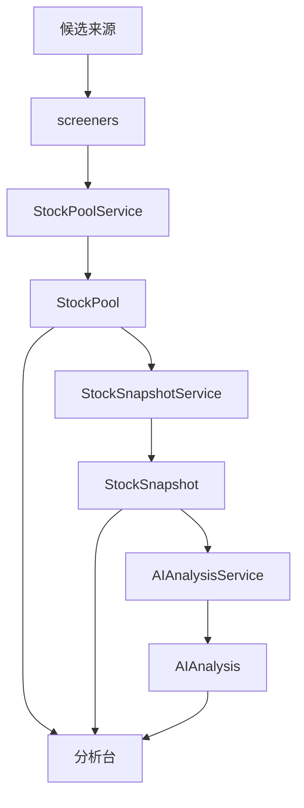

# Product Objects

日期：2026-04-24

## 目标

把当前工程底座升级成“股票池驱动的分析产品”。

当前产品对象分成三类：

1. `StockPool`
2. `StockSnapshot`
3. `AIAnalysis`

## StockPool

`StockPool` 是一级产品对象，用来表达“看哪些股票”。

它支持两类来源：

- 手动维护
- 程序自动生成

后续还会扩展：

- AI 自动候选池
- 临时观察池
- 主题池

当前建议的池类型：

- `theme_pool`
- `system_pool`
- `watchlist`
- `tradable_universe`

当前存储路径约定：

- `data/reference/system/stock_pools/<pool_type>/<pool_id>.json`

## StockSnapshot

`StockSnapshot` 是单只股票的产品级摘要，用于界面展示和 AI 消费。

它不是原始行情，也不是某个筛选规则对象，而是聚合后的展示对象。

当前设计会逐步聚合这些输入：

- `Security`
- 最新 `Bar`
- 事件信息
- 指标结果
- 筛选状态
- 所属股票池

当前存储路径约定：

- `data/processed/snapshots/<symbol>.parquet`

后续也可以根据前端需要增加 `json` 视图。

## AIAnalysis

`AIAnalysis` 是面向产品层的分析结果对象。

当前它先作为结构化结果占位，后续再接真正的模型调用。

它的职责是输出：

- 风险等级
- 建议动作
- 摘要说明
- 关键观点
- 警示信息

当前存储路径约定：

- `outputs/reports/ai_analysis/<target_type>/<target_id>.json`

## 结构边界

- `screeners`：规则和筛选决策
- `services`：产品对象编排
- `storage`：数据和产物物理组织
- `core`：底层数据模型与产品对象模型

## 调用关系

