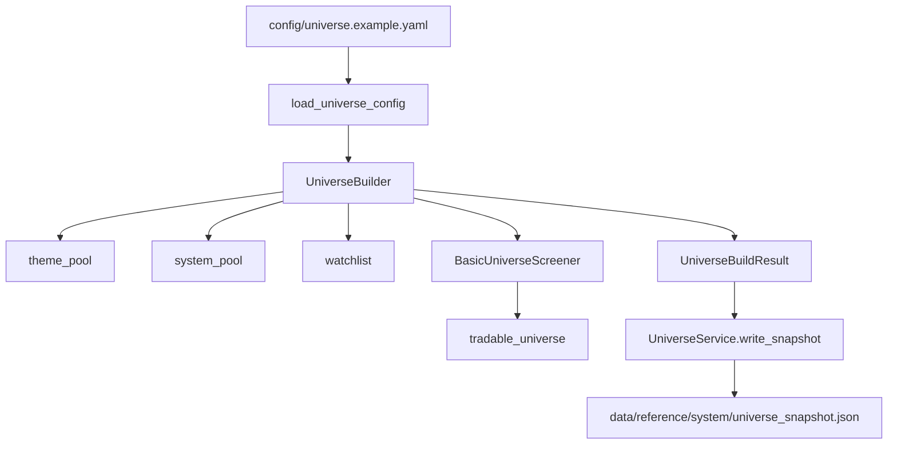

# Stock Screening Design

日期：2026-04-24

## 目标

先把“看哪些股票”设计清楚，再推进“这些股票怎么买卖”。

当前筛选设计分成四层：

1. 候选来源层
2. 股票池构建层
3. 基础筛选层
4. 后续评分与交易决策层

## 候选来源

当前支持的候选来源设计：

- `manual`：用户直接指定的标的
- `themes`：按主题维护的股票集合
- `system.seed_symbols`：系统内置的种子标的，例如指数 ETF
- `ai`：未来 AI 自动判断候选的入口

这些来源会先合并去重，不会在来源阶段直接决定买卖。

## 股票池层次

系统先形成四类池子：

- `theme_pool`：来源于主题的候选池
- `system_pool`：系统种子池和未来 AI 候选池
- `watchlist`：全部候选去重合并后的观察池
- `tradable_universe`：通过基础筛选后的可交易池

## 基础筛选规则

`tradable_universe` 当前设计采用硬条件过滤：

- 最低股价
- 最低市值
- 最低平均成交额
- 最低上市月数
- 允许交易所白名单
- 排除名单

如果某只股票缺少基础数据，不会直接误判为通过，而是标记为 `pending_data`。

## 当前实现状态

已完成：

- 配置模型 `screeners/config.py`
- 候选与决策模型 `screeners/models.py`
- 基础规则引擎 `screeners/rules.py`
- 股票池构建器 `screeners/builder.py`
- Universe 快照输出服务 `services/universe.py`
- 构建脚本 `scripts/build_universe.py`

当前限制：

- 还没有把基础筛选所需的 reference 数据接入进来
- `tradable_universe` 在缺少 snapshot 时会为空，这是刻意保守设计
- 下一步需要补 `security metadata` 和 `screening snapshot` 数据同步

## 调用关系

